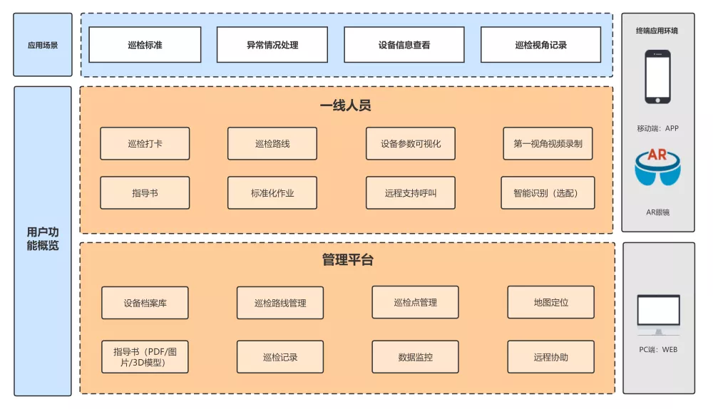

**介绍：**  【陆巡软件】设备点巡检、二维码/NFC/GPS巡检，AR巡检、无人机巡检，是一款全开源可商用的系统，前后端分离开发，包含管理后端，管理前端、小程序端，使用方便，二开方便！同时有商业版提供对接AR设备、无人机设备等、安装使用也很简单

**功能模块：** 

1.巡检项目管理
2.巡检点管理
3.巡检计划
4.巡检任务
5.巡检报表
6.事件管理
7.事件跟踪
8.巡检设备二维码生成管理
9.用户管理：用户是系统操作者，该功能主要完成系统用户配置。
10.部门管理：配置系统组织机构（公司、部门、小组），树结构展现支持数据权限。
11.岗位管理：配置系统用户所属担任职务。
12.定时任务：在线（添加、修改、删除)任务调度包含执行结果日志。
13.代码生成：前后端代码的生成（java、html、xml、sql）支持CRUD下载 。
14.系统接口：根据业务代码自动生成相关的api接口文档。
15.服务监控：监视当前系统CPU、内存、磁盘、堆栈等相关信息。
16.缓存监控：对系统的缓存信息查询，命令统计等。
17.连接池监视：监视当前系统数据库连接池状态，可进行分析SQL找出系统性能瓶颈。

 **业务架构：** 

**技术架构：** 

1.基于若依框架做二次开发，用于开源，还与开源

2.这里是列表文本前端采用Vue、Element UI。

3.后端采用Spring Boot、Spring Security、Redis & Jwt。

4.权限认证使用Jwt，支持多终端认证系统。

5.支持加载动态权限菜单，多方式轻松权限控制。

6.高效率开发，使用代码生成器可以一键生成前后端代码。

**开源须知：** 

1.仅允许用于个人学习研究使用.

2.禁止将本开源的代码和资源进行任何形式任何名义的出售.

3.软件受国家计算机软件著作权保护（登记号：2021SR0805085）。

4.限制商用，如果需要商业使用请联系我们。QQ110189312联系群主。

**商业版亮点：** 

1.商业版支持对接二维码、NFC、AR设备、机器人、无人机等，全方位满足不同场景的巡检需求

2.商业版提供【巡检管理】模块

3.商业版拥有移动端，目前仅支持小程序端，后期会支持APP

4.商业版提供可视化大屏功能

5.商业版提供技术支持，开源版只有开源交流

 **官方群聊：** 

QQ技术：110189312

微信号：lunhaikeji

 **代码贡献：** 

有很多热心开源的小伙伴为咱们平台提交PR或者提出好的建议，基本合格的PR我们都接受，这样您的头像就列入到咱们陆巡仓库的贡献者列表啦！

如何贡献

1、fork一份代码至自己的账号下，本地修改您要提的代码，提交至您fork的仓库

2、登录gitee后到陆巡仓库下创建Pull Requests,选择您的仓库到Snowy的dev分支，提交即可

因为dev分支是团队开发分支，并不是统一发版本的测试过的，所以我们建议提代码至dev即可

 **外包开发：** 

如果您（或您公司）有外包开发需求，可以微信联系或QQ联系，提交您的需求，经过工作量分析，出具合适的报价，合作开发并交付。

本团队具备雄厚的技术人才力量，均跟随陆巡团队发展至今，已完全熟练每一处细节代码，您的产品自然也是由陆巡平台进行开发并交付。

1、工期保障 2、源码质量保障 3、节点按时汇报

 **系统美图：** 

